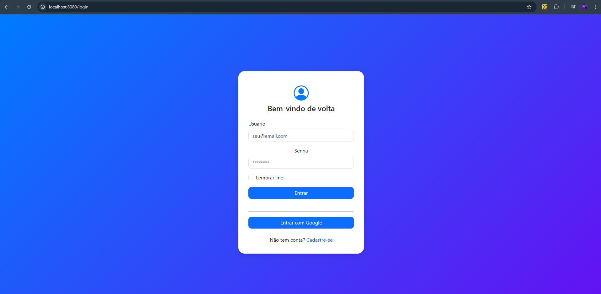
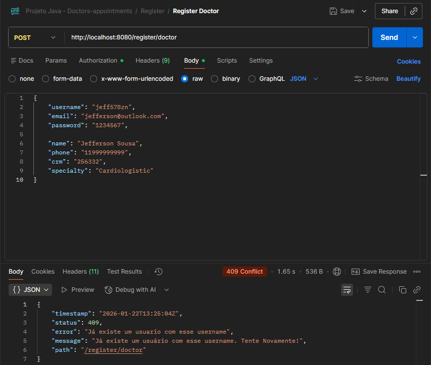
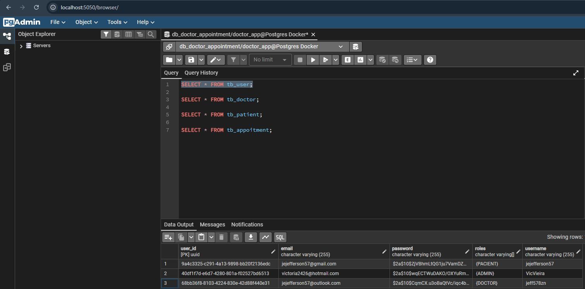

# Doctors Appointment - Agendamento de Consultas Médicas 

**Doctors Appointment** é uma **API REST** desenvolvida em **Java** com **Spring Boot**, voltada para o gerenciamento de agendamentos médicos. A aplicação permite o cadastro de médicos e pacientes, o controle e a validação de consultas, além de contar com autenticação e autorização utilizando **Spring Security**, garantindo a organização, integridade e segurança dos dados.

### O sistema permite:


- Cadastro e gerenciamento de médicos, pacientes e consultas de forma centralizada, permitindo uma organização eficiente da agenda médica.

- Controle de agendamentos, com validação de horários permitidos e prevenção de conflitos, impedindo que um mesmo médico possua mais de uma consulta no mesmo horário.

- Validação das regras de negócio relacionadas aos agendamentos, garantindo integridade, consistência e confiabilidade das informações.

- Histórico de consultas e agendamentos, possibilitando a consulta e auditoria das alterações realizadas no sistema.

- Implementação de autenticação e autorização com Spring Security, assegurando o acesso controlado aos recursos da aplicação.

- O objetivo do sistema é fornecer uma solução eficiente e segura para o gerenciamento de consultas médicas, reduzindo conflitos de agenda, erros operacionais e melhorando a organização dos atendimentos.


---

## 🚀 Tecnologias Utilizadas

- **Java 21** -  linguagem principal do projeto.
- **Spring Boot** - framework para construção da API REST.
- **Spring Security** – Implementação de autenticação e autorização.
- **OAuth2 (Google)** – Autenticação social utilizando conta Google.
- **MapStruct** – Mapeamento entre entidades e DTOs de forma eficiente e segura.
- **Lombok** - biblioteca para reduzir boilerplate no Java.
- **Hypersistence Utils** – Recursos avançados para otimização e manipulação de dados com JPA/Hibernate.
- **Thymeleaf** – Renderização de páginas HTML para interfaces simples.
- **Spring Boot DevTools** – Agilidade no desenvolvimento com reload automático.

### 🧪 Testes
- **Junit 5** - criação de testes unitários.
- **Mockito** - mock de dependências nos testes.
- **H2 Database** - banco em memória utilizado nos testes.
- **Postman** - teste e documentação dos endpoints da API.

### 🗄️ Banco de Dados
- **PostgreSQL** - banco de dados relacional utilizado.

### 📦 Build & Infraestrutura
- **Docker** – Containerização da aplicação.
- **Docker Compose** – Orquestração dos serviços (API, banco de dados e SGBD).
- **Maven** - gerenciamento de dependências e build do projeto.

---

## Vizualização da Página de Login



---

## Vizualização de registro no Postman



---

## Vizualização dos usuários no Banco de Dados



---

## Como Rodar o Projeto

- [Docker Desktop](https://www.docker.com/get-started/) instalado.

- Caso queria rodar sem Docker, basta só alterar as variaveis de ambiente e rodar a aplicação na sua IDE, porém precisa instalar o PostgreSQL e PgAdmin na sua maquina.

### 📝 Passo a passo

1. **Baixe e instale o Docker.**

   Caso ainda não tenha instalado, baixe o [Docker](https://www.docker.com/get-started/).

2. **Dentro do Projeto crie um arquivo .env**

    O arquivo só recebe a extensão, não deve ter nome, vai ser exatamente assim:

    

3. **Declarar váriaveis de ambiente dentro do .env**

    ``` .env
    DB_HOST=postgres
    POSTGRES_DB=doctor_appointment
    POSTGRES_USER=doctor
    POSTGRES_PASSWORD=doctor123
    POSTGRES_PORT=5432

    PGADMIN_EMAIL=admin@admin.com
    PGADMIN_PASSWORD=admin123

    SPRING_PROFILES_ACTIVE=prod

    GOOGLE_CLIENT_ID= Deve Gerar no Google Cloud
    GOOGLE_CLIENT_SECRET= Deve Gerar no Google Cloud
    ```

    Obs: Você deve acessar e gerar o CLIENT_ID e o CLIENT_SECRET no google cloud, sem eles você não consegui executar o projeto.


4. **Gerar arquivo .jar**

    no seu terminal:
    ``` bash
    mvn clean package

5. **Executar Docker Compose**

    no seu terminal:
    ``` bash
    docker compose up -d --build
    ```
    Agora é só testar o login no [localhost:8080](http://localhost:8080) ou os endpoints da api com postman ou como preferir.

6. **Para acessar o PgAdmin**

    Link PgAdmin: [http://localhost:5050](http://localhost:5050)

    ``` text
    login: admin@admin.com
    senha: admin
    ```

    obs: Você deve configurar o postgres dentro do PgAdmin quando conseguir logar.

<br><br>

---

## 🙋 Sobre o Autor

Desenvolvido por Jefferson Sousa  
[GitHub](https://github.com/JeffSSousa) | [LinkedIn](https://www.linkedin.com/in/jefferson-sousa-8b93a81a2/)
